## Hi there, I'm Elivelton Santos and i work with application development.
  
### ⚙️ GitHub Analytics

Sou um desenvolvedor e entusiasta de tecnologia que adora criar ferramentas que as pessoas realmente usam. Compartilho conhecimentos sobre engenharia de software e boas práticas de desenvolvimento, colaborando com a comunidade tech.

Atualmente, atuo no desenvolvimento de soluções completas, desde o front-end até a automação de infraestrutura. Ao longo da minha jornada, colaboro ativamente com outros profissionais e equipes, ajudando a transformar ideias em produtos reais através de código limpo, arquitetura sólida e entregas de qualidade.

Ha mais de 4 anos, venho me aprofundando em arquitetura de software, boas práticas como Clean Architecture e SOLID, explorando novas tecnologias e ajudando a transformá-las em implementações práticas no mundo real. 👋
O que eu faço:

    🚀 Desenvolvimento de sistemas completos (Full Stack)

    🎨 Criação de interfaces com React e Figma

    ⚙️ Automação de processos e infraestrutura com Docker

    🐧 Desenvolvimento em ambientes Linux

    📱 Apps e sistemas com Node.js, TypeScript, JavaScript, PHP e Python

    🧠 Arquitetura limpa e princípios SOLID

    🤝 Colaboração técnica com equipes e startups parceiras

    📝 Conteúdo técnico e compartilhamento de conhecimento

Stacks e ferramentas:

Front-end: React, JavaScript, TypeScript, Figma
Back-end: Node.js, PHP, Python, APIs REST
Arquitetura: Clean Architecture, SOLID, Design Patterns
DevOps & Infra: Docker, Linux, Automação
Outros: Git, Metodologias Ágeis, Integração Contínua

---

  <h3><b>📍 Profile Visitor Count</b></h3>

  

  

  
  
  
  
  
  
  

